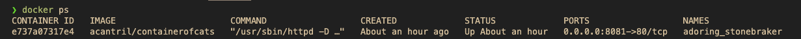
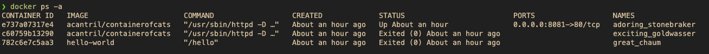
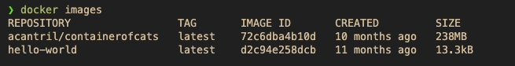
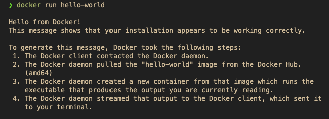
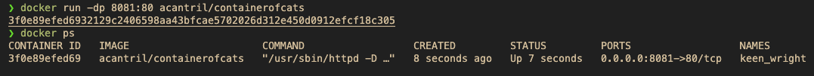
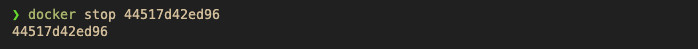
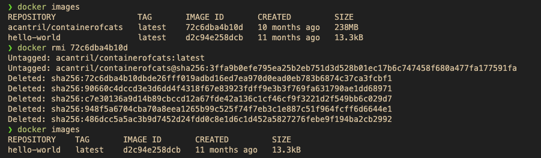
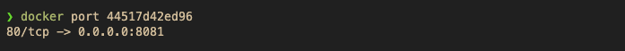
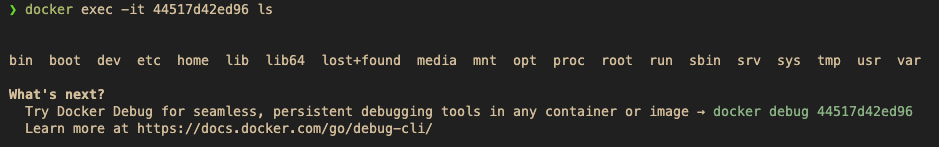

---
tags:
  - docker
---
# Docker Commands

- `docker ps`: list running Docker containers

-  `docker ps -a`: list all Docker containers

- `docker images`: list downloaded Docker images on Docker Host

- `docker run`: run a Docker container if present locally, otherwise download
  it from Docker Hub

- `docker run -p <host_port>:<container_port> <image_name>`: run a Docker
      container and map a port from the host to the container 

- `docker run -dp <host_port>:<container_port> <image_name>`: run a Docker
      container in detached mode and map a port from the host to the container

- `docker stop <container_id>`: stop a running Docker container

- `docker pull`: download a Docker image from Docker Hub

- `docker rm <container_id>`: remove a Docker container

- `docker rmi <image_id>`: remove a Docker image

- `docker inspect <container_id>`: inspect a Docker image

- `docker port <container_id>`: list the ports mapped to a Docker container

- `docker exec -it <container_id> <command>`: execute a command in a running

