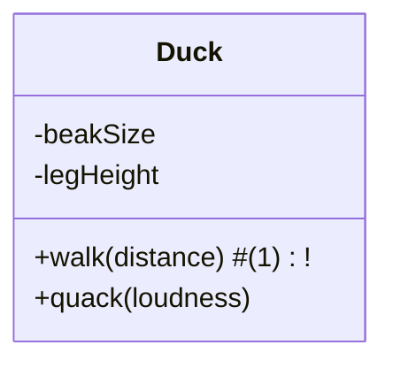

---
tags:
- Java
---

# Introduction

## Object-Oriented Programming Paradigms

- Object-Oriented Programming (OOP) is an attempt in using the computer as an
  expressive medium to port our ideas into the machine.

## Abstractions

- Like all languages, programming languages are abstractions - general tools
  that are designed to represent more specific models of real life concepts.
- Let's take a look into different programming languages sorted by least
  abstract (closest to the
  machine) and most abstract (closest to natural language).

```markmap
- Languages
    - Assembly
    - Imperative Languages
      - Procedural Languages
      - Object-Oriented Languages
    - Declarative Languages
      - Logical Languages
      - Functional Languages
```

- ### Assembly
    - In the world of computers an Assembly Language is the minimal abstraction
      of the
      communication between human and the computer, which is often described as
      low-level language.
      It can be directly translated into machine code, but it uses mnemonics to
      represent the instructions
      to make it easier to understand (for example, on an Intel microprocessor,
      inc ("increase by one") is a mnemonic.).
    - Example of an Assembly code:

  ```asm

  .DATA
  var	DB 64  	; Declare a byte, referred to as location var, containing the value 64.
  var2	DB ?	; Declare an uninitialized byte, referred to as location var2.
  DB 10	; Declare a byte with no label, containing the value 10. Its location is var2 + 1.
  X	DW ?	; Declare a 2-byte uninitialized value, referred to as location X.
  Y	DD 30000    	; Declare a 4-byte value, referred to as location Y, initialized to 30000.
  ```

    - In order to convert assembly language into machine code it needs to be
      translated using an
      assembler.
    - This converts each statement into the specific machine code needed for the
      hardware on
      which it is being run.
    - There is a one-to-one relationship between an assembly language
      instruction and its machine code
      equivalent.
    - Each CPU has its own version of machine code and assembly language.
    - Although assembly languages are easier to program with than machine code,
      it is still
      time-consuming and specialist work.
    - It is mainly reserved for writing specific instructions for embedded
      systems such as washing
      machines or air-conditioning control systems.

- ### Imperative Programming
- Imperative programming can be described as being concerned with:
> "how to do something, not what to do"

- Imperative Programming can take many forms, two most important approaches in
  historical (ascending) order are:


- #### Procedural Paradigm
    - Based on subroutines (a sequence of program instructions that performs a
      specific task) that contain a series of computational steps to be carried
      out prepared for re-executing a predefined block of code. In simple words:
      the sequences of statements designed to reach a certain goal.
    - It is takes a **top-down** approach to problem-solving, where the problem
      is divided hierarchically into a number of smaller tasks and those tasks
      can be divided into smaller sub-tasks and so on:
  ```mermaid
  flowchart TD
  Problem --> Task-1
  Problem --> Task-2

  Task-1 --> Subtask-1
  Task-1 --> Subtask-2

  Task-2 --> Subtask-3
  Task-2 --> Subtask-4
  ```

    - The most known procedural languages are: *FORTRAN*, *BASIC*, *C*
    - Example of *C* code:
    ```c
    #include<stdio.h>
  
    // function declaration
    float findArea(float l, float b); 
  
    int main()
    {
      float length, width, result;
  
      printf("Enter the length and width of the rectangle: ");
      scanf("%f %f", &length, &width);
  
      result = findArea(length, width); //function calling
      printf("Area of rectangle = %.2f\n",result);
  
      return 0;
    }
  
    // function to find ara of rectangle
    // function definition
    float findArea(float l, float b)
    {
      float area;
      area = l * b;
      return area; //return statement
    } 
    ```

- #### Object-Orietned Paradigm
    - It is designed to provide general tools for solving problems
    - Representation of solutions for problems is done by using objects -
      entities with grouped functionalities and information
    - It takes a **bottom-up** approach: bottom level modules developed first (
      Lower level module developed, tested and debugged). Then the next module
      developed, tested and debugged. This process is continued until all
      modules have been completed:

  ```mermaid
  flowchart TD
  Task-1 --> General-Task-1
  Task-2 --> General-Task-1

  Task-3 --> General-Task-2
  Task-4 --> General-Task-2
  General-Task-1 --> Problem-Solution
  General-Task-2 --> Problem-Solution
  ```

- ### Declarative Programming

    - Declarative programming can be described as being concerned with:
      > "what to do something, not how to do it."
    - Declarative programming is to program on a higher level of abstraction
      than imperative programming.
    - Two most known approaches are:

    - #### Logical Paradigm
        - Is largely based on formal logic.
        - Any program written in a logic programming language is a set of
          sentences in logical form, expressing facts and rules about some
          problem domain.
        - Semantic of logic programming:
            - `H if B1 and … and Bn. `
                - `H` is called the head of the rule and `B1, ..., Bn` is called
                  the body. Facts are rules that do not have body.

    - #### Functional Paradigm
        - It is a programming paradigm where programs are constructed by
          applying and composing functions.
        - Those functions ideally are pure functions - whose results are
          dependent only upon the input parameters, and operations initiates no
          side effect, that is, makes no external impact besides the return
          value.
        - Functional programming philosophy is not to modify data outside the
          function
        - Functional example in Java:
      ```java hl_lines="8-13"
  
      // Program creates list with numbers and letters, then searches for those starting with letter "c" and
      // changes them to uppercase, sorts them and prints them out
      List<String> myList =
          Arrays.asList("a1", "a2", "b1", "c2", "c1");
  
  
      myList
          // functions
          .stream()
          .filter(s -> s.startsWith("c"))
          .map(String::toUpperCase)
          .sorted()
          .forEach(System.out::println);
      ```

    - Table with key differences between *declarative* and *imperative*
      approaches:

  |Characteristic|Imperative approach|Functional approach|
    |--------------------|-------------------------|-------------------------|
  |Programmer focus|How to perform tasks (algorithms) and how to track changes in state.|What information is desired and what transformations are required.|
  |State changes|Important.|Non-existent.|
  |Order of execution|Important.|Low importance.|
  |Primary flow control|Loops, conditionals, and function (method) calls.|Function calls, including recursion.|
  |Primary manipulation unit|Instances of structures or classes.|Functions as first-class objects and data collections.|

!!! Tip "Paradigms vs Real Life"
Modern programming languages tend to integrate many paradigms, for example in
OCaml you can use object-oriented, imperative, functional programming paradigms.
t mixes all these paradigms and lets you use the most appropriate (or most
familiar) programming paradigm for the task at hand.

    Java is mainly an Object-Oriented Language, however as seen in previous code block it supports functional programming.

## Diving into Object-Oriented Thinking

- Objects are representations of abstract data types - *classes*
- Creating abstract data types (classes) is a fundamental concept in
  object-oriented programming
- A class describes a set of objects that have identical characteristics (data
  elements, like variables or other objects) and behaviors (functionality).
- Once a class is established, you can make as many objects of that class as you
  like and then manipulate their state.
- You make a request of that object—complete a transaction, draw something on
  the screen, turn on a switch
- Each object accepts only certain requests, defined by its **interface**.
- Example: `class Duck diagram`:



- `class Duck` code:
  ``` java
  class Duck { // (1)! 
    int beakSize;
    int legHeight;

    
    void walk(int distance) { // (2)!
      // ...
    }
    String quack(int loudness) { // (3)!
      // ...
    }
  }
  ```
    1. class is sometimes called a type like `Duck` type
    2. This is part of the interface of the class
    3. This is part of the interface of the class too

- creating `Duck` object:
  ``` java title="Creating Duck Object"
  Duck duck_1 = new Duck();
  duck_1.quack("loudly")  // (1)! 
  ```
    1. Using the interface of the `Duck` class

  <!-- - creating `Duck` object
  ```java 
 
  ```
  1.  -->

- `Duck` has 2 functionalities in its **interface**: it can walk and quack (this
  is what ducks do).
- The interface describes what you can request from specific object, you send
  it (`d1.quack()`) and object performs action based upon it (specific duck
  performs its quacking code).
- Processing data in object is done via *methods* `walk(distance)` is a method (
  method is function that is associated with an object) and method is an
  object-oriented function.
- To send a message you choose the object reference (`d1`) place dot after it
  and write method name.

!!! Note "Difference Between Function and Method"
A function is a mathematical concept. For example:

       `f(x,y) = sin(x) + cos(y)`

    says that function `f()` will return the sin of the first parameter added to the cosine of the second parameter.  It's just math.  As it happens `sin()` and `cos()` are also functions.  
    A function has another property: **all calls to a function with the same parameters, should return the same result.**

    A method, on the other hand, is a function that is related to an object in an object-oriented language.  It has one implicit parameter: the object being acted upon (and it's state).

    So, if you have an object `Z` with a method `g(x)`, you might see the following:

      `Z.g(x) = sin(x) + cos(Z.y)`

    In this case, the parameter `x` is passed in, the same as in the function example earlier.  However, the parameter to `cos()` is a value that lives inside the object `Z`.  `Z` and the data that lives inside it (`Z.y`) are implicit parameters to `Z`'s `g()` method.

## Hiding Implementation Details

- We can break up the playing field into class creators (those who create
new data types) and client programmers (the class consumers who use the data
types in their applications).~
- The goal of the class creator is to build a class that exposes only what’s  
necessary to the client programmer and keeps everything else hidden.
  - So the first reason for access control is to keep client programmers’ hands off portions they
 shouldn’t touch—parts necessary for the internal operation of the data type but not part of the 
 interface that users need to solve their particular problems.
    - This is actually a service to client programmers because they can easily see what’s important and 
what they can ignore.
  - The second reason for access control is to enable the library designer to change the internal 
   workings of the class without worrying about how it will affect the client programmer.


- C`lass creator can change the hidden portion at will without 
worrying  about the impact on anyone else. The hidden portion usually 
represents  the 
---

Inspirations and Sources

- [Alan Kay's Definition Of Object-Oriented](https://wiki.c2.com/?AlanKaysDefinitionOfObjectOriented)
- [Explanation of UML Diagrams](https://aviadezra.blogspot.com/2009/05/uml-association-aggregation-composition.html)
- [Mermaid Class Diagrams used in my documents](https://mermaid-js.github.io/mermaid/#/classDiagram)
- <https://amzotti.github.io/programming%20paradigms/2015/02/13/what-is-the-difference-between-procedural-function-imperative-and-declarative-programming-paradigms/>
- <https://stackoverflow.com/questions/155609/whats-the-difference-between-a-method-and-a-function>