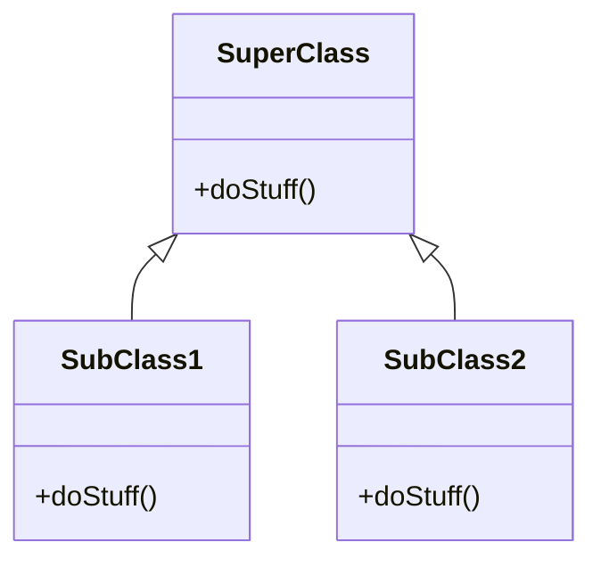
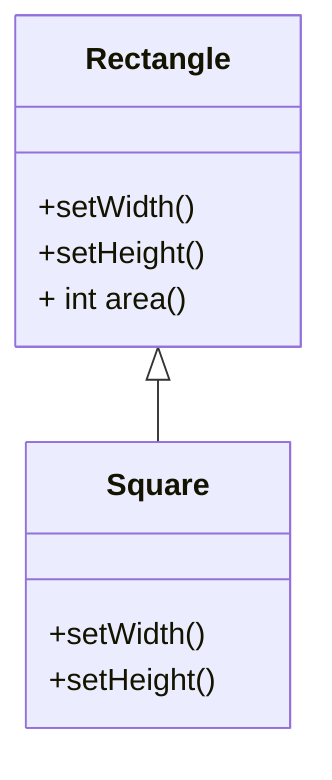
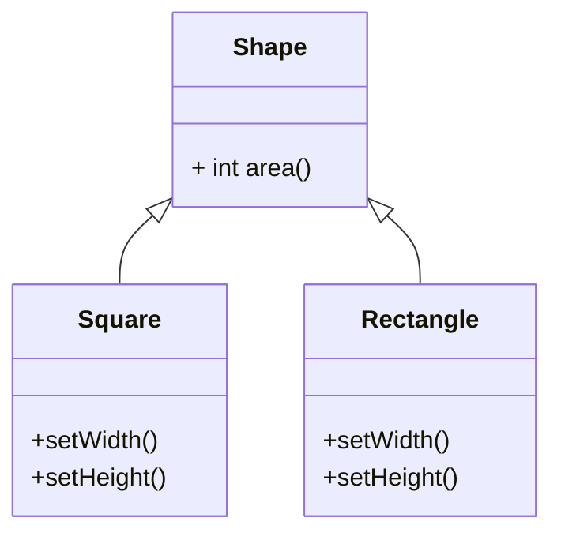

# Liskov Substitution Principle

!!! Definition 
    Subtype Requirement: $\phi(x)$ be a property provable about objects $x$ of type $T$. Then  $\phi(y)$ should be true for objects $y$ of type $S$ where $S$ is a subtype of $T$.

It basically means subtypes must be behaviorally substitutable for their base types.

## Benefits
- it gives a way to define good inheritance hierarchies
- increases caution when designing classes to avoid creation of hierarchies that do not conform to the [[Open-Closed-Principle]].

!!! Example
	In clientMethod, superObj may be an instance of SuperClass or any of its subclasses.
	Hence, if clientMethod works with instances of Superlass, it does so with instances of any subclass of SuperClass. They provide all methods of SuperClass and can be extended by adding more



```java
public void clientMethod(SuperClass sc)
{
    sc.doStuff();
}
```

## LSP by Example

### LSP-non-compliant Example

Let assume that we want classes that represents rectangles and squares.
Since square *is* a rectangle designer of class might think it is a good idea to make `Square` class a subclass of `Rectangle`.



```java
package design.lsp.bad;

public class Rectangle
{
    int width;
    int height;

    public void setWidth(int width) {this.width = width;}

    public void setHeight(int height) {this.height = height;
    }

    public int area() {return  height * width;}
}
```

We override `setWidth` and `setHeight` so both will stay the same and we can reuse the implementation of `area`.

```java
package design.lsp.bad;

public class Square extends Rectangle
{
    @Override
    public void setWidth(int width)
    {
        System.out.println("==== Square begin setWidth() ====");
        super.setWidth(width);
        super.setHeight(width);
        System.out.println("==== Square end setWidth()   ====");
    }

    @Override
    public void setHeight(int height)
    {
        System.out.println("Square begin setHeight()");
        super.setHeight(height);
        super.setWidth(height);
        System.out.println("Square end setHeight()");
    }
}
```

We can  pass `Square` wherever `Rectangle` is expected, as far as the Java type system is concerned so the model is consistent with that regard.
However, if we use such design, our program might break when client is making `Rectangle` assumptions on our `Squares` without knowledge that operation on the subclass is performed and the first side change will be overridden.
=== "Source"
    ```java
    package design.lsp.bad;

    public class Client
    {
        public static void main(String[] args)
        {
            Square square = new Square();
            clientMethod(square);
        }
        public static void clientMethod(Rectangle rectangle)
        {
            rectangle.setHeight(5);
            rectangle.setWidth(3);
            System.out.println("rectangle.area() = " + rectangle.area());
            assert (rectangle.area() == 15) : "Outcome is not 15";
        }
    }

    ```
=== "Output"
    ```java
    Square begin setHeight()
    Rectangle.setHeight()
    Rectangle.setWidth()
    Square end setHeight()
    ==== Square begin setWidth() ====
    Rectangle.setWidth()
    Rectangle.setHeight()
    ==== Square end setWidth()   ====
    rectangle.area() = 9
    Exception in thread "main" java.lang.AssertionError: Outcome is not 15
    	at design.lsp.bad.Client.clientMethod(Client.java:15)
    	at design.lsp.bad.Client.main(Client.java:8)
    
    Process finished with exit code 1	
    ```
A Square does not comply with the behavior of a rectangle: Changing the height or width of a square is different  from changing dimensions of rectangle so the model breaks Liskov Substitution Principle.

!!! Warning
    Validity of hierarchy design cannot be judged by looking at hierarchy in isolation.
    We need to inspect possible uses by client and its assumptions.


### LSP-compliant Fix

- To fix the issue we can introduce `Shape` class and two descendants: `Square` and `Rectangle`
- Client of `Shape` should not make any assumptions on our setter methods.
- If client want to change property of shape it should contact specific concrete class.
- It allows to calculate correct area for object of that class.



### Behavioral Subtyping

We can look at Liskov Substitution Principle in behavioral aspect: it requires behavioral  substitutability. 

!!! note "Behavioral Substitutability"
    $S$ is a behavioral subtype of $T$, if objects of type $T$ in a program $P$ may be replaced by objects of type $S$ without altering any of the properties of $P$.

- It is not enough that subclasses provide all methods declared in superclass, those method should behave like they were from that superclass
- subclasses have to be distinguishable by the client.

## Breaking LSP in the wild

Even Java has classes that break LSP, one of them is `Properties`.
If you are like me and want to know everything about stuff you are reading about, there is [[Properties]] article.
