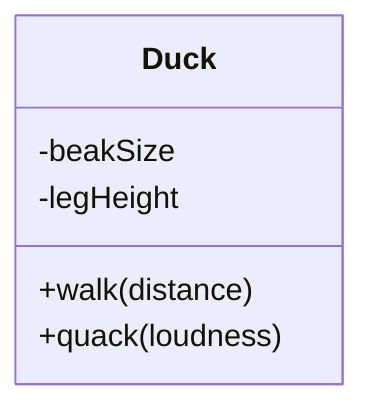
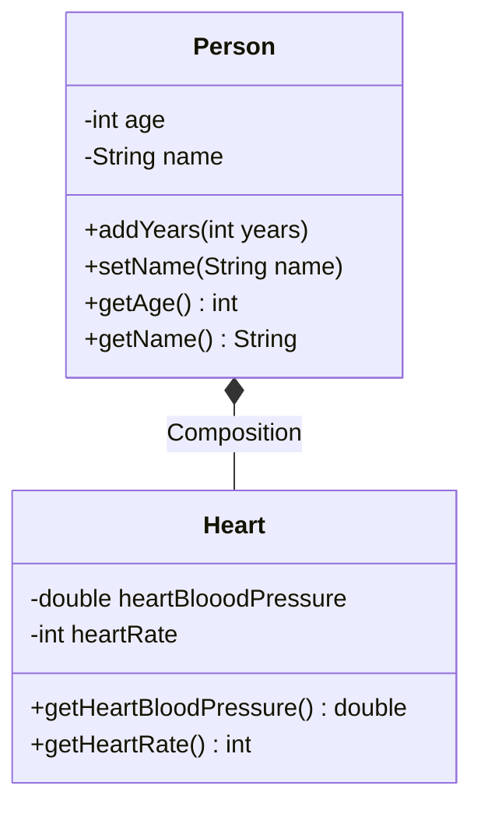
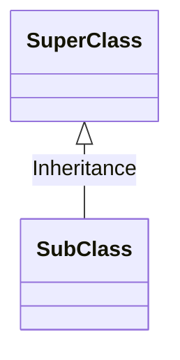
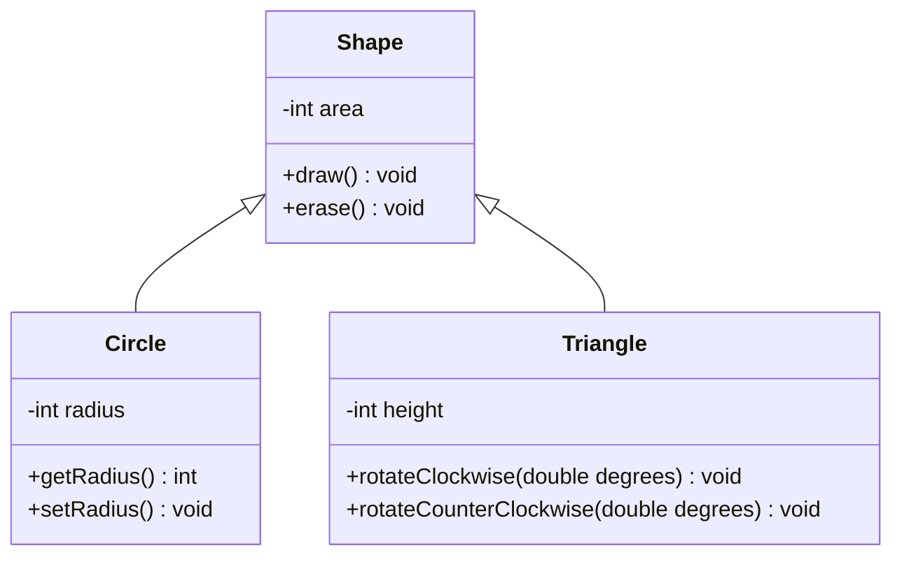

Next step of evolution were imperative languages which are the sequences of statements
designed to reach a certain goal, for example *C* language.
They provided abstraction for an assembly language however they were so so
specific that you weren't able to leave the realm of thinking in terms of the computer structure
to focus on the problem itself. The product of that effort is the code that is hard to
read and understand.
!!! info "Imperative Programming"
imperative programming is a
[programming paradigm](https://en.wikipedia.org/wiki/Programming_paradigm "Programming paradigm")
that uses [statements](https://en.wikipedia.org/wiki/Statement_(computer_science))
"Statement (computer science)")
that change a program's [state](https://en.wikipedia.org/wiki/State_(computer_science))
"State (computer science)").
You might want to read [[imperative vs functional language ]]

Alternatively to computer-like models there are languages with the focus on problems you're trying
to solve - Prolog for example - it uses chains of relations which can be checked by queries.
They have one caveat though which is that if you step out the domain of the problems those
languages are designed for, you
will end up with pretty unwieldy code - for example Prolog's non-deterministic (definition: even
for the same input algorithm, can exhibit different behaviors on different runs) evaluation strategy
is problematic for deterministic computations.

!!! info "Deterministic Computation"
A deterministic [model of computation](https://en.wikipedia.org/wiki/Model_of_computation "Model of computation"), for example
a [deterministic Turing machine](https://en.wikipedia.org/wiki/Deterministic_Turing_machine "Deterministic Turing machine")
, is a model of computation such that the successive states of the machine and the operations to be
performed are completely determined by the preceding state.

!!! info "Non-deterministic Algorithm"
a **nondeterministic algorithm** is
an [algorithm](https://en.wikipedia.org/wiki/Algorithm "Algorithm") that, even for the same input,
can exhibit different behaviors on different runs, as opposed to
a [deterministic algorithm](https://en.wikipedia.org/wiki/Deterministic_algorithm "Deterministic algorithm".

The Object-Oriented Programming paradigm tries to overcome this issue by providing general tools for
working with the problems, so instead thinking about the language you can focus on the work you're
trying to do (to some extent).

Fundamental part of being able to grasp general concepts is the process of creating abstractions, in
OOP we use abstract data types which are called *classes*.
If you had the luck of learning about Aristotle, you can think about classes a bit like
in his concept used for the classification of living things - for example: the abstract class of
live bearing tetrapods can be represented by specific object like someone's cat named Oreo.

In OOP we create new definitions for the reality we are trying to map, and the new ways to represent
data - we call them data types.

So, to be specific with definitions: a *class* is description for object's characteristics (data)
and functionalities (behavior) which becomes *interface* of the communication.

If you're interested of what is a *true* OOP approach, we could look at what Alan Kay said
about [Small Talk](https://en.wikipedia.org/wiki/Smalltalk) (first influential OOP language):

## Alan Kay definition of OOP by Small Talk

1. **Everything is an object**. It works like special variable that stores data and you give request
   to achieve desired effect and change its state - like you press button to get soda from a vending
   machine, but you can map virtually anything to object representation.
2. **Objects can communicate by sending and receiving messages** - working program is like multiple
   ports (objects) that send each other ships (data) through river streams (it could be inside
   program or in the network)
3. **Each object has its ow memory which consists of other objects**. You can picture it as some
   kind of [bento meal](https://en.wikipedia.org/wiki/Bento) - the whole dish consists of many sub
   parts, but you take one package, so you just eat whole thing and don't think about complexity
   inside when you don't have to.
4. Each object is an instance of a class. Class is representing general grouping like for example $1
   \in \mathbb{N}$ 1 is an instance (object) of an $\mathbb{N}$ set.
5. The class is the repository for _behavior_ associated with an object. It means that all objects
   of the same class can perform the same action. For example mouse button and keyboard key are
   Buttons, so they both have Key Pressed functionality.

## Interface of the Object

In real world many objects are of the same kind movies, games etc. A class (which is often called
a *type* - a pet Captain Meows is a *type* of Cat) is an abstract data type for object: a blueprint

- it describes functionalities by what kind of behaviors are possible so we can modify object
  characteristics - an *interface*. If we have specified class we can create as many objects as we can
  and the only constraints are resources of the computer.



```java
Duck d1=new Duck();
        d1.quack("loudly")
```

`Duck` has 2 functionalities in its *interface*: it can walk and quack (this is what ducks mostly
do). The interface describes what you can request from specific object, you send it (`d1.quack()`)
and object performs action based upon it (specific duck performs its quacking code). Also a small
but important bit of terminology:

- `d1` is a **reference** for the `Duck`object.
- processing data in object is done via *methods* (`walk(distance)` is a method) and method is an
  object-oriented fuction

!!! info "fuction vs method"
A **function** is a piece of code that is called by name. It can be passed data to operate on (i.e.
the parameters) and can optionally return data (the return value). All data that is passed to a
function is explicitly passed.
A **method** is a piece of code that is called by a name that is associated with an object. In most
respects it is identical to a function except for two key differences:

1. A method is implicitly passed the object on which it was called
2. A method is able to operate on data that is contained within the class (remembering that an
   object is an instance of a class - the class is the definition, the object is an instance of that
   data).

To send a message you choose the object reference (`d1`) place dot after it and write method name.

## Objects As Service Providers

When you are designing on working with Object-Oriented Program you can look at objects as _service
providers_. In that way you are creating, importing (or pasting form stackoverflow) set of objects
that are providing services that solve your problem. Thinking in such way may help you improve *
cohesiveness* of your code, in other words your parts of program will fit together well, and you
won't have desire to put too many functionalities in a single object. For example when you are
designing a calculator, the object `Button` should provide service for pressing it, not the
calculation itself. After that you can pair specific `Button` press to perform a request
to `Calculation` object that has `multiply`
method.

Treating objects as service providers brings benefits also for consumers of your program - if
someone finds services of your object useful, they can be fitted to other programs more easily.

## Hiding the implementation

As you have seen - we should consider other people using our programs - clients.

The goal of the client programmer is to collect a toolbox full of classes to use for rapid
application development. Our job is to build a class that exposes only what’s necessary to the
client programmer and hide everything else and keeps everything else hidden. It is useful, because
we can change the hidden portion without worrying about the impact of breaking workflow of a client.
Why? Because if it’s hidden, the client programmer which means the class creator can change the
hidden portion at will without worrying about the impact on anyone else and it reduces the
possibility of introducing new bugs, because client has less stuff to break. It is also beneficial
for the client because if we hide code that is not used for problem-solving by them.

Java has 4 ways of setting access boundaries for a class:

- public

  - means the element is available to everyone
- private

  - means no one can access the element except you - inside methods of that type. Anyone trying to
    access a private member gets a compile-time error.
- protected

  - protected works like private, except of the inheriting class which can access protected
    members
- default

  - It is when you don't use any access modifier. It is sometimes called the package access
    because classes can access the members of other classes in the package, but outsite those look
    like private.

## Reuse

There are two methods of reusing your code in Java:

- composition
- inheritance

### Composition

If you think your class needs features of another class you can place object of that class inside.
It is called composition, because you compose a new class from existing classes.
The need for such design is when you ask yourself "does my class has a ...?"
(*has-a relationship*). For example `Heart` is good candidate to be used in composition with
a `Person` - `Person` has a `Heart`.

Diagram for such construction looks like that:



!!! tip "Clarification of the diagram"
We should be more specific and use the composition link in cases where in addition to the part-of
relationship between `Person` and `Heart` - there’s a strong lifecycle dependency between the two,
meaning that when
`Person` is deleted then `Heart` is also deleted as a result. The composition link shows that a
class (container, whole) has exclusive ownership over other class/s (parts), meaning that the
container object and its parts constitute a parent-child/s relationship. If you are interested in
reading more about class diagrams you can check it
[here](https://aviadezra.blogspot.com/2009/05/uml-association-aggregation-composition.html)
and diagrams in this article are built by
[Mermaid library](https://mermaid-js.github.io/mermaid/#/classDiagram)
(you should read that too).

Features of the Composition:

- it is flexible:
  - member objects of new class are private most of the time so changing them does not break
    client code.
- you can change your code at the runtime, so you don't have worry if your program won't compile (
  good for extending features) and inheritance imposes compile-time restrictions.

### Inheritance

Sometimes you might want to clone a class and add few features to it to *extend* it.
Inheritance is just that, but you don't have to rewrite unchanged part of the functionalities or if
you change the first class the class under it is changed too. The base class is called a **
superclass** or a **parent** and copy is called a **subclass** or a **child**. I prefer using
superclass and subclass terminology, because it is used extensively in the official documentation.
Here is diagram representation of inheritance.



Arrow should point to the base class.

#### General Features of The Inheritance

- Superclass should contain the core of functionalities shared amongst its subclasses.
- With the inheritance you don't need to create intermediate models to provide solution for a
  problem
- It represents _is-a_ relationship: superclass has in possession all the members of the base
  class (however **private** elements are not available at clients disposition), so it duplicates
  all its features (and has possibility to add more functionalities), **so subclass is always a type
  of superclass**

#### The Ways of Implementing The Inheritance

You can implement inheritance in two ways:

- **Add new methods to a subclass.**

  You basically add new functionalities to the subclasses thus
  differentiate and make them more specific.
  This is the most common way of implementing inheritance.



- **Change behavior of existing classes.**
  It relies on the fact that the base class already has methods and you can change what they do.
  It is like telling the program "I have superclass method here, but I want it to perform something
  different". There is special term for this process called _**overriding**_.
  In the following example we are *overriding* `draw` and `erase` method of `Shape` class.

  ```mermaid
  classDiagram
  Shape <|-- Square
  Shape <|-- Circle

  class Shape {
    -int area

    +draw() void
    +erase() void
  }

  class Square {
    +draw() void
    +erase() void
  }
  class Circle {
    +draw() void
    +erase() void
  }
  ```

  We are drawing shapes in different ways: `circle.draw()` and `triangle.draw()` will perform task in specific way.

Inheriting from an existing type creates a new type. This new type contains not only all the members
of the existing type (although the private ones are hidden away and inaccessible), but more
importantly it duplicates the interface of the base class. That is, all messages accepted by
base-class objects are also accepted by derived-class objects. We know the type of a class by the
messages it accepts, so the derived class is the same type as the base class.

Understanding the concepts of the inheritance is not enough to write a good code while using it.
There are several design principles that you should follow when implementing your solutions,
you can read more about them [here](/Java_Notes/md_java/design).

!!! Warning
This is still work in progress and everything past following line will be changed / removed soon

---

[comment]:

## Objects vs normal life

Real-world objects share two characteristics: They all have *state* and
*behavior*. Dogs have state (name, color, breed, hungry) and behavior
(barking, fetching, wagging tail).

Software objects are conceptually similar to real-world objects: they too consist of state and
related behavior. An object stores its *state*
in **fields** (variables in some programming languages) and exposes its
*behavior* through **methods** (functions in some programming languages). Methods operate on an
object's internal state and serve as the primary mechanism for object-to-object communication.


For example in object - bike attributing state (current speed, current pedal cadence, and current
gear) and providing methods for changing that state, the object remains in control of how the
outside world is allowed to use it.


!!! warning Hiding internal state and requiring all interaction to be performed through an object's
methods is known as ***data encapsulation*** - a fundamental principle of object-oriented
programming.

### Benefits Of Object Oriented Programming {#subsec:benefits-of-object-oriented-programming}

- **Modularity**
  Source code for objects can be maintained independently of other objects source code (like parts
  for modular guns can make close combat rifle or sniper rifle)

* **Information-hiding**
  By interacting only with an object's methods, the details of its internal implementation remain
  hidden from the outside world (like computer's keyboard keys - we provide plastic shell for
  touching and do not expose circuits which can be easily damaged)
* **Code re-use**
  If an object already exists (perhaps written by another software developer), you can use that
  object in your program. This allows specialists to implement/test/debug complex, task-specific
  objects, which you can then trust to run in your own code (You can copy stuff from stackoverflow
  and it works, and you still have a job)

- **Pluggability and debugging ease**
  If a particular object turns out to be problematic, you can simply remove it from your application
  and plug in a different object as its replacement. This is analogous to fixing mechanical problems
  in the real world.

## What Is a Class? {#sec:what-is-a-class?}

In the real world, you'll often find many individual objects all the same kind. There may be
thousands of other bicycles in existence, all the same make and model. Each bicycle was built
from the same set of blueprints and therefore contains the same components. In object-oriented
terms, we say that your bicycle is an instance of the class of objects known as bicycles. **A class
is the blueprint from which individual objects are created.**

Let see class describing bicycle:

```java
package core.oop_concepts.e02_classes;

public class Bicycle {
    // Those fields will represent object's state
    int cadence = 0;
    public int speed = 0;
    int gear = 1;

    //  Those methods will represent object behaviour
    void changeCadence(int newValue) {
        cadence = newValue;
    }

    void changeGear(int newValue) {
        gear = newValue;
    }

    void speedUp(int increment) {
        speed = speed + increment;
    }

    void applyBrakes(int decrement) {
        speed = speed - decrement;
    }

    void printStates() {
        System.out.println("cadence:" +
                cadence + " speed:" +
                speed + " gear:" + gear);
    }
}
```

And here is code that will create bicycle objects and change their state via methods:

```{#lst:lstinputlisting2 .java style="myjava" label="lst:lstinputlisting2"}
package core.oop_concepts.e02_classes;
import helpers.OutToFile;

public class BicycleDemo
{
    public static void main(String[] args) {
        //  Create helper object for saving console output to file (for automation in my writing)
        OutToFile of = new OutToFile("classes_out");
        // Create two different
        // Bicycle objects
        Bicycle bike1 = new Bicycle();
        Bicycle bike2 = new Bicycle();

        // Invoke methods on
        // those objects
        bike1.changeCadence(50);
        bike1.speedUp(10);
        bike1.changeGear(2);
        bike1.printStates();

        bike2.changeCadence(50);
        bike2.speedUp(10);
        bike2.changeGear(2);
        bike2.changeCadence(40);
        bike2.speedUp(10);
        bike2.changeGear(3);
        bike2.printStates();
    }
}
```

Output:

```{#lst:lstinputlisting3 style="myout" label="lst:lstinputlisting3"}
cadence:50 speed:10 gear:2
cadence:40 speed:20 gear:3
```

## What Is Inheritance {#sec:what-is-inheritance}

Object-oriented programming allows classes to inherit commonly used state and behavior from other
classes. In this example, Bicycle now becomes the superclass of MountainBike, RoadBike, and
TandemBike. In the Java programming language, each class is allowed to have one direct superclass,
and each superclass has the potential for an unlimited number of subclasses:


The syntax for creating a subclass is simple. At the beginning of your class declaration, use the
extends keyword, followed by the name of the class to inherit from:

```{#lst:lstinputlisting4 .java style="myjava" label="lst:lstinputlisting4"}
package core.oop_concepts.e03_inheritance;

import core.oop_concepts.e02_classes.Bicycle;

public class MountainBike extends Bicycle
{
    // This gives MountainBike all the same fields and methods as Bicycle  yet allows its code to focus exclusive on the features that make it unique
    int num_of_dampers = 1; // field only for mountain bikes

    /*
        This makes code for your subclasses easy to read. However, you must take care to properly document the state and behavior that each superclass defines, since that code will not appear in the source file of each subclass.
    */
}
```

## What Is an Interface {#sec:what-is-an-interface}

As you've already learned, objects define their interaction with the outside world through the
methods that they expose. Methods form the object's interface with the outside world; the buttons on
the front of your television set, for example, are the interface between you and the electrical
wiring on the other side of its plastic casing. You press the \"power\" button to turn the
television on and off. In its most common form, an interface is a group of related methods with
empty bodies. A bicycle's behavior, if specified as an interface, might appear as follows:

```{#lst:lstinputlisting5 .java style="myjava" label="lst:lstinputlisting5"}
package core.oop_concepts.e04_interfaces;
public interface BicycleInterface
{
    void changeCadence(int newValue);

    void changeGear(int newValue);

    void speedUp(int increment);

    void applyBrakes(int decrement);
}

```

To implement this interface, you'd use the `implements` keyword in the class declaration:

```{#lst:lstinputlisting6 .java style="myjava" label="lst:lstinputlisting6"}
package core.oop_concepts.e04_interfaces;

public class GiantBike implements BicycleInterface
{
    int cadence = 0;
    int speed = 0;
    int gear = 1;

    // The compiler will now require that methods
    // changeCadence, changeGear, speedUp, and applyBrakes
    // all be implemented. Compilation will fail if those
    // methods are missing from this class.


    public void changeCadence(int newValue) {
        cadence = newValue;
    }

    public void changeGear(int newValue) {
        gear = newValue;
    }

    public void speedUp(int increment) {
        speed = speed + increment;
    }

    public void applyBrakes(int decrement) {
        speed = speed - decrement;
    }

    void printStates() {
        System.out.println("cadence:" +
                cadence + " speed:" +
                speed + " gear:" + gear);
    }
}
```

Implementing an interface allows a class to become more formal about the behavior it promises to
provide. Interfaces form a contract between the class and the outside world, and this contract is
enforced at build time by the compiler. If your class claims to implement an interface, all methods
defined by that interface must appear in its source code before the class will successfully compile.

## What Is a Package {#sec:what-is-a-package}

A package is a namespace that organizes a set of related classes and interfaces. Conceptually you
can think of packages as being similar to different folders on your computer. You might keep HTML
pages in one folder, images in another, and scripts or applications in yet another. Because software
written in the Java programming language can be composed of hundreds or thousands of individual
classes, it makes sense to keep things organized by placing related classes and interfaces into
packages. The Java platform provides an enormous class library (a set of packages) suitable for use
in your own applications. This library is known as the \"Application Programming Interface\", or
\"API\" for short. Its packages represent the tasks most commonly associated with general-purpose
programming. For example, a String object contains state and behavior for character strings; a File
object allows a programmer to easily create, delete, inspect, compare, or modify a file on the
filesystem; a Socket object allows for the creation and use of network sockets; various GUI objects
control buttons and check boxes and anything else related to graphical user interfaces. There are
literally thousands of classes to choose from. This allows you, the programmer, to focus on the
design of your particular application, rather than the infrastructure required to make it work.

Here is the view of packages that are created for this chapter:

{#fig:figure4}

