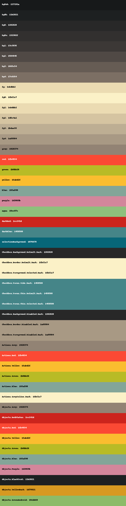

# visualhex

Small script written in Python that looks for hex colors in JSON files and produces PDF, JPEG, or PNG with visual representation.

- Dependencies:
 - `reportlab`

Example of usage
```shell
visualhex example/sample.json out.png
```

Output:

