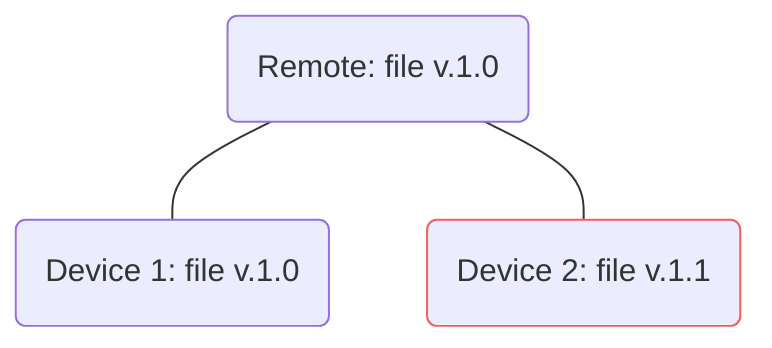

# Conflict resolutions

??? Info "Legend for Diagrams"

    ```mermaid
    graph LR;
    A(node) --- B(Internet Connection)
    ```
  
    ```mermaid
    graph LR
    C(node) -.- D(No Internet Connection)
    ```    

    ```mermaid
    graph LR;
    A(sending data)  --"[optional info]" --> B(recieving data)
    ```

    ```mermaid
    graph LR;
    A(sending data)  --> B(current action):::purple
    classDef purple stroke:#d9bff2
    ```    

    ```mermaid
    graph LR;
    A(sending data)  --> B(error/conflict):::red
    classDef purple stroke:#d9bff2
    classDef red stroke:#f25f55

    ```    

## Edit / Edit 

- Machines modify the same lines in a file.

### With the Internet connection

- Device 2 modified some number of lines of `file` that are present on `Remote` 


    
#### Resolution Strategies

##### 1. "Last Edit Wins"
  - Automatically replace conflicting file with the most recent version

=== "Step 1"
    - Remote will get version from `Device_2`
    ```mermaid

    graph LR;
      Remote("Remote: file v.1.1"):::purple  
      Device_2("Device_2: file v.1.1"):::red  -- push --> Remote 
      Remote ---  Device_1("Device_1: file v.1.0")
     
      classDef red stroke:#f25f55
      classDef purple stroke:#be8de3
    ```

=== "Step 2"
    - Device_1 will sync up version from Remote
    ```mermaid
    
    graph LR;
      Remote("Remote: file v.1.1")
      Device_2("Device_2: file v.1.1") --- Remote 
      Remote -- pull -->  Device_1("Device_1: file v.1.1"):::purple
     
      classDef red stroke:#f25f55
      classDef purple stroke:#be8de3
    ```
##### 2. "Smart Edit Wins"

"Last Edit Wins" until some of the following parameters met, if so: manual conflict resolution

  - Possible parameters
    - `numlines`: `int` - manual resolution if any conflicting is >= some integer lines
    - `wordsdiff`: `float` - manual conflict resolution if total percentage of words in lines differ
  
  [[cosine similarity]]


### Edit / Edit Without the Internet

=== "All Devices Synced"
    - "All devices synced and connected to the Internet"

    ```mermaid
    graph TD;
      Remote("Remote: file v.1.0") 
      Remote --> Device_1("Device 1: file v.1.0") 
      Remote --> Device_2("Device 2: file v.1.0")

    ```
 
=== "Device 2 & 3 disconnected"
    - `Device_2` making changes to the file while disconnected from the Internet:

    ```mermaid
    graph TD;
      Remote("Remote: file v.1.0") 
      Remote -->  Device_1("Device 1: file v.1.0")
      Remote -.-> Device+2("Device 2: file v.1.1"):::purple
      classDef red stroke:#f25f55
      classDef purple stroke:#a48ed4

    ```
=== "Device 2 connects to the Internet"
    - `Device_2` and `Device_3` are making changes to the file while disconnected from the Internet:

    ```mermaid
    graph TD;
      Remote("Remote: file v.1.0") 
      Remote -->  Device1("Device_1: file v.1.0")
      Remote --> Device2("Device_2: file v.1.1"):::red
      classDef red stroke:#f25f55
      classDef purple stroke:#be8de3
    ```

#### Resolution Strategies

##### Last edit wins

- Replace conflicting file

  


### Delete / Edit

- 3 Devices connected to the Internet

```
Remote: -
  +Device_1
  +Device_2
  +Device_3
```
- Device_1 creates `file.txt` (`Device_1: timestamp 1`)
- Device_1 pushes change to git and rest sync it up:
```
Remote: file.txt (Device_1: timestamp 1)

  + Device_1: file.txt (Device_1: timestamp 1)
  + Device_2: file.txt (Device_1: timestamp 1)
  + Device_3: file.txt (Device_1: timestamp 1)
```
- Device_2 and Device_3 are disconnected from the Internet:
```
Remote: file.txt (Device_1: timestamp 1)
  + Device_1: file.txt (Device_1: timestamp 1)
  - Device_2: file.txt (Device_1: timestamp 1)
  - Device_3: file.txt (Device_1: timestamp 1)
```
- Device_1 deletes file
```
Remote:         -
  + Device_1: -
  - Device_2: file.txt (Device_1: timestamp 1)
  - Device_3: file.txt (Device_1: timestamp 1)
```

- Device_2 and Device_3 are making changes to the file:
```
Remote:         -
  + Device_1: -
  - Device_2: file.txt (Device_2: timestamp 2)
  - Device_3: file.txt (Device_3: timestamp 3)
```
- Device 2 is connected to the Internet
```
Remote:         -
  + Device_1: -
  + Device_2: file.txt (Device_2: timestamp 2)
  - Device_3: file.txt (Device_3: timestamp 3)
```


##### Possible Resolutions

A) Assume that if user edited the deleted file, deletion not was not intentional.
- Every other version is synced to the first conflicting file and it will be treated as most recent change
```

Remote:         file.txt (Device_2: timestamp 2)
  + Device_1: file.txt (Device_2: timestamp 2)
  + Device_2: file.txt (Device_2: timestamp 2)
  + Device_3: file.txt (Device_2: timestamp 2)
```
- **now if newly connected device has files with the same names and differing text in the same lines, it will be treated as Edit/Edit conflict** 


B) choose-auto
 - Inform user about Delete/Edit conflict and allow for choosing if keep edit or delete it. 
 - If file has been restored it will be treated as most recent change and every other device will sync up to it. 
C)

- if 
```
Device_2 appears with con
```